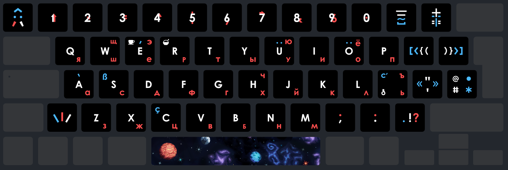

# lightsaber Keyboard v3.0
EN-RU Keyboard layouts bundle

## What it is?

Two keyboard layouts (latin and cyrillic letters), suitable for most european languages and basic slavic languages typing.

`lighsaber_mod.bundle` is a file for [Ukelele Layout Editor](https://software.sil.org/ukelele/)

`print_keyboard_yu_mac_3.0.pdf` and `eps` are fiels for printing (I've printed vinyl stickers for my MacBook).

`print_keyboard_yu_mac_3.0.afphoto` is a source file for Affinity Designer.

The main idea is to have all punctuation in the same place in both layouts, and also to correct some strange traditions, as brackets or slashes being in different places.

## Some keys explanation

- Left top key is a diacritic symbols/modifiers key. So it depicts **Diacritus** - fictional wise man with a beard.
- Number keys with a shift modifier produce the following symbols: `↑`,`×`,`€`,`^`,`$`,`§`,`→`,`&`,`%`,`☐`
  - Keys `1`and `7` with option modifier produce `↓`and `←` (the inverted arrows)
  - Key `0` with option and shift-option modifiers produce `☒`and `☑`, forming a complete checkbox behaviour
- The hieroglyphs for _minus_ and _equals_ keys mean the following:
  - _minus_ produces `-`,`— (m dash)`,`_`,`~` for `normal`,`shift`,`option`,`option`&`shift` respectively
  - _equals_ produces `=`,`+`,`!=`,`±` for `normal`,`shift`,`option`,`option`&`shift` respectively
- Slashes key is called a **Lightsaber Key**, because it depicts three lightsabers or different colors.
- The key to the right of `L` produces `ь|Ь` and `ъ|Ъ` for cyrillic and `the|The` and `c'est|C'est` for latin.
  - That is why it is illustrated with symbols _c'_ for `c'est` and [voiced dental fricative](https://en.wikipedia.org/wiki/Voiced_dental_fricative) symbol (or [Old English Eth](https://en.wikipedia.org/wiki/Eth) letter) for `the`
- Cup and bowl are symbols for languages. I did not want to use flags or write letters, so I decided to use something silly... and have chosen food. Cup of tea is a symbol of english and bowl of porridge is [каша](https://en.wikipedia.org/wiki/Kasha).

## Colors explanation

White is default value, blue is with `option` or `shift`&`option` modifiers, orange is in cyrillic.
In general, `shift`&`option` is located on top of option.

### Some exclusions

- Number keys and `,`, `.` have alternative symbols in red instead of white to distinguish between basic and alternative symbol. From my experience, blue color here can confuse, because it would lead to think that it uses `option`. Note that in fact they use `shift`.
- `щ`,`э`,`ю`,`ё`,`ч`,`ъ` are also red despite being produced with `option` modifier. This is to clearly distinguish cyrillic letters.
- There are alternative designs in the source file. There is also a version where `ч` is on the `j` key and `й` is an _option_ for `и` key.
